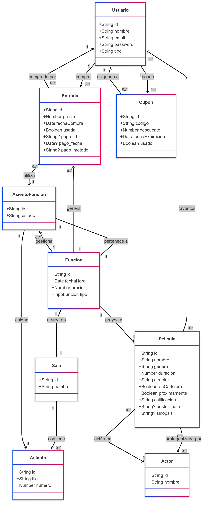

# Propuesta TP TTADS

## Grupo
### Integrantes
* 40283 - **Caparros, Hernán**

### Repositorios
* [frontend app](https://github.com/hernancap/backend-TTADS-CINE.git)
* [backend app](https://github.com/hernancap/frontend-TTADS-CINE.git)

## Tema
### Descripción
Aplicación Web de un Cine en el que un usuario puede comprar entradas para las funciones de las películas que están en cartelera, así como también poder ver los detalles de las películas que se estrenarán en el futuro y poder agregarlas a favoritos en su perfil.

### Modelo

## Alcance Funcional 

|Req|Detalle|
|:-|:-|
|CRUD simple|1. CRUD Película 2. CRUD Actor 3. CRUD Sala 4. CRUD Usuario|
|CRUD dependiente|1. CRUD Asiento (depende de Sala) 2. CRUD Cupón (depende de Usuario) 3. CRUD Función (depende de Película y Sala) 4. CRUD Entrada (depende de Función y Usuario)|
|Listado + detalle| 1. El Listado de películas está dividido en 3 partes: Las que ya se estrenaron y dejaron de estar en cartelera no se muestran en pantalla, las que están en cartelera se muestran en una sección mientras que las películas a estrenar en el futuro están en otra sección. Al hacer click en una película se muestra su detalle.  2. Listado de Entradas en el Perfil del Usuario que al hacer click se entra a su detalle.|
|CUU/Epic|1. Comprar Entrada 2. Agregar película a favoritos 3. Acceder a reportes (solo Admin)|